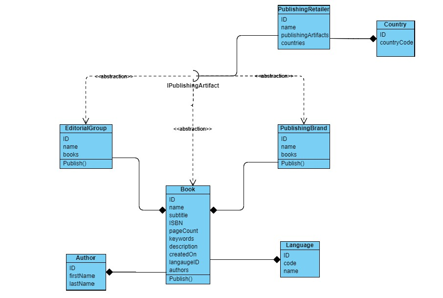

# LibroData - Gestiunea si livrarea de carti electronice

# Introducere
Odată cu digitalizarea a mare parte din industrii, și industria distriburii cărților a fost modificată. În acest context, prezentăm mai departe cum funcționează entitățile ce modelează procesul de distribuire a cărților electronice.
Entitatea **Book** este elementul de bază al domeniului. Ea este caracterizată de următoarele:
- ID (identificator unic) - name (numele de publicare al cărții)
- subtitle (subtitlu al cărții, opțional)
- ISBN (identificat unic al cărții, format string, e.g. 9782806231789, cunoscut de entități externe)
- pageCount (număr de pagini) - keywords (cuvinte cheie ale cărții, separate prin ; )
- languageID (limba în care este scrisă)
- createdOn (data adăugării în sistem a cărții)
- authors (listă de autori)

Mai departe, definim Entitatea **Language**. Ea are următoarele proprietăți:
- ID (identificator unic)
- code (cod de limbă, prescurtare a limbii)
- name

Entitatea **Author**, cu următoarele caracteristici:
- ID (identificator unic)
- firstName
- lastName

Entitatea **PublishingBrand** – orice carte poate sau nu să treacă în publicare printr-un brand care se ocupă de publicare – cu următoarele proprietăți:
- ID (identificator unic)
- name
- books (listă de cărți publicate de un brand în parte)

Entitatea **EditorialGroup** – orice carte care poate sau nu să treacă înainte de publicare printr-un brand care se ocupa de editarea cărții – cu următoarele proprietăți:
- ID (identificator unic)
- name
- books (listă de cărți publicate de un brand în parte)

Mai departe prezentăm entitatea **PublishingRetailer**, care este efectiv firma care publică cărțile în magazinele online, spre exemplu – Google, Amazon, Apple, etc. Ei sunt cei care afișează cărțile pe platformele lor, și au următoarele proprietăți:
- ID (identificator unic)
- name
- publishingArtifacts (listă de entități publicabile
- tip IPublishingArtifact)
- countries (listă cu țările în care respectivul retailer publică)

Logica este următoarea – către **PublishingRetailer** pot fi publicate cărți direct de la autori, prin entitatea **Book**, de la **EditorialGroup** – care implică publicarea către retailer a tuturor cărților ce sunt editate la un editorial group; respectiv de la **PublishingBrand** – cărțile dintr-un brand de publicare merg automat și la retailerii unde acel **PublishingBrand** aparține.
Interfața **IPublishingArtifact** conține o metodă `Publish()` ce întoarce un **String**, care conține metadata respectivului artifact.
Mențiune – o carte poate fi publicată unui **PublishingRetailer** prin oricare din cele 3 canale – direct de autor, prin editorial group, respectiv prin publishing brand.

Entitatea **Countries**, care are următoarele proprietăți:
- ID (identificator unic)
- countryCode (cod pentru țară, din două litere – e.g., RO pentru România)

# Fisierele pentru initializare
În contextul acestei teme, vi s-au pregătit câteva seturi de date pe baza cărora să inițializăm biblioteca virtuală de cărți. Acestea se vor importa printr-un set de fișiere de inițializare – fișiere de intrare.
Primiți așadar următoarele fișiere, separatorul este “###”:
- `books.in` – inițializarea cărților în sistem, header-ul fișierului sunt proprietățile clasei Book, fără proprietarea authors
- `languages.in` – inițializarea limbilor în sistem, header-ul fișierului sunt proprietățile clasei Language
- `authors.in` – inițializarea autorilor în sistem, header-ul fișierului sunt proprietățile clasei Authors
- `books-authors.in` – inițializarea asocierilor dintre cărți și autori, headerul fișierului sunt idurile cărții și , respectiv al autorului
- `editorial-groups.in` – inițializarea grupurilor de editare din sistem, header-ul fișierului sunt proprietățile clasei EditorialGroup
- `publishing-brands.in` - inițializarea grupurilor de publicare din sistem, header-ul fișierului sunt proprietățile clasei PublishingBrand
- `editorial-groups-books.in` – inițializarea asocierilor dintre grupuri de editare și autori, headerul fișierului sunt id-urile grupului de editare și , respectiv al autorului
- `publishing-brands-books.in` – inițializarea asocierilor dintre grupuri de publicare și autori, headerul fișierului sunt id-urile grupului de publicare și , respectiv al autorului
- `publishing-retailers.in` – inițializarea retailerilor din sistem, header-ul fișierului sunt proprietățile clasei PublishingRetailer
-  `countries.in` – inițializarea țărilor din sistem, header-ul fișierului sunt proprietățile clasei Country
- `publishing-retailers-countries.in` – inițializarea asocierilor dintre retailer și țări, headerul fișierului sunt id-urile retailerului și, respectiv, al țării
- `publishing-retailers-books.in` - inițializarea asocierilor dintre retailer și cărți, headerul fișierului sunt id-urile retailerului și, respectiv, al cărții
- `publishing-retailers-editorial-groups.in` - inițializarea asocierilor dintre retailer și grupuri de editare, headerul fișierului sunt id-urile retailerului și, respectiv, al grupului de editare
- `publishing-retailers-publishing-brands.in` - inițializarea asocierilor dintre retailer și grupuri de publicare, headerul fișierului sunt id-urile retailerului și, respectiv, al grupului de publicare
- 
### **O vedere generală a entităților din Librodata este disponibliă mai jos. Diagrama claselor**

# Implementare
**Book.java**
- (Override) Metoda equals intoarce true daca doar ID a 2 carti sunt egale.
- Metoda Publish scrie intr-un string in format xml toata informatia despre o carte.

**Language.java**
- Constructorii, getterele si setterele.

**PublishingBrand.java**
- Are doi constructori, unul cu toate variabilele componente si altul doar cu ID.
- (Override) Metoda equals intoarce true daca doar ID a doua PublishingBrand-uri sunt egale.
- Metoda Publish scrie intr-un string in format xml toata informatia despre un PublishingBrand.

**EditorialGroup.java**
- Are doi constructori, unul cu toate variabilele componente si altul doar cu ID.
- (Override) Metoda equals intoarce true daca doar ID a doua EditorialGroup-uri sunt egale.
- Metoda Publish scrie intr-un string in format xml toata informatia despre un EditorialGroup.

**PublishingRetailer.java**
- Are doi constructori, unul cu toate variabilele componente si altul doar cu ID.
- (Override) Metoda equals intoarce true daca doar ID a doi PublishingRetaileri sunt egale.

**Countries.java**
- Are doi constructori, unul cu toate variabilele componente si altul doar cu ID.
- (Override) Metoda equals intoarce true daca doar ID a doua Countries sunt egale.

**ReadFromFile.java**
- *Metoda InitLists*  
        Primeste ca parametru fisierul din care trebuie sa citeasca, si o variabila de tip string , care poate
        fi: authors,books,languages,editorial-groups,publishing-brands,editorial-groups,publishig-retailers si 
        countries. In dependenta de ce string este primit ca parametru functia stie ce obiect trebuie sa creeze
        cu ajutorul constructorului potrivit , apelat cu un numar fix de parametri ,si unde trebuie sa il adauge
        (functioneaza ca un fel de strtok din c). Aceasta functie returneaza o lista de tip obiect la care ii fac
        cast in main intr-o lista de tip potrvit.

- *Metoda addAuthorsToBook*  
        Primeste ca parametru fisierul din care trebuie sa citeasca, lista de carti si lista de autori. Dupa ce 
        extrage cu ajutorul line.split id-ul cartii si id-ul autorului, creaza o carte aux1(respectiv un autor aux2) cu 
        id-ul citit din fisier. books.indexOf(aux1) reintoarce un intreg cu indexul din lista books a cartii cu acelasi id.
        apeland books.get() de indexul aflat mai sus, gaseste cartea la care trebuie sa adaug autorii. Cu ajutorul 
        .getAuthors() primeste lista de autori a cartii date, iar cu .add() adauga noul autor in lista de autori. Indexul 
        autorului il gaseste ca si pe cel al cartii cu ajutorul authors.indexOf (aux2).
    
- *Metoda addBooksToEG , addBooksToPB*  
        Metodele ulterioare vor functiona dupa acelasi algoritm, se creeaza un obiect nou de tipul x citit din fisier
        cu id-ul corespunzator, se cauta cu ajutorul .indexOf care returneaza indexul obiectului x din lista cu acelasi id, 
        cu ajutorul .get de indexul aflat mai sus gasesc obiectul x. De asemenea se creeaza un nou obiect de tip y citit din 
        fisier cu id corespunzator , se cauta cu .indexOf indexul obiectului y din lista cu acelasi id, iar cu ajutorul .get
        de indexul aflat mai sus gasesc si obiectul y. Mai ramane sa adauge in lista potrivita a obiectului x obiectul y, cu 
        ajutorul .add .
    
- *Metoda addListsToPR*  
        Aceasta metoda este o imbinare a metodei InitLists si metodelor addAuthorsToBook, addBooksToEG si addBooksToPB.
        Primeste ca parametru fisierul din care trebuie sa citeasca, lista de retaileri, lista de tari, lista de carti, 
        lista de EditorialGroups, lista de PublishingBrands si un String , care ca si la InitLists stie in care lista 
        ce obiect trebuie sa adauge.
        Daca stringul din parametri este "Countries" adauga in lista de Countries a clasei PublishingRetailer tara cu id
        citit din fisier. Daca stringul din parametri este "Book" , "EditorialGroups" sau "PublishingBrands" adauga in lista
        PublishingArtifacts obiectele de tipul dat.

**Administration.java**
- *Metoda returnRetailer*  
        Primeste ca parametri lista de retaileri si id unui retailer si returneaza indexul retailerului din lista de retaileri 
        care are acel id.
    
- *Metoda getBooksForPublishingRetailerID*  
    Primeste ca parametru id unui retailer si reintoarce o lista cu toate cartile acelui retailer.
    Pentru inceput cu ajutorul metodei returnRetailer se gaseste retailerul care trebuie analizat.
    Creaza o lista goala de carti in care va adauga toate cartile acestui retailer.
    Parcurge toate elementele din PublishingArtifacts si verifica pe rand:
    - Daca elementul i din PublishingArtifacts este instanta a lui Book , dupa ce face cast de la PublishingArtifacts la Book,
    verifica daca cartea i nu este deja in lista de carti care trebuie sa o returneze, iar daca nu este, adauga cartea in lista.
    - Daca elementul i din PublishingArtifacts este instanta a lui EditorialGroup, pune intr-o lista de tip Book toate cartile
    acelui EditorialGroup, si parcurge fiecare carte din aceasta lista, verificand daca ea nu este deja in lista pe care o 
    returneaza, si o adauga in caz afirmativ.
    - Daca elementul i din PublishingArtifacts este instanta a lui PublishingBrand, pune intr-o lista de tip Book toate cartile
    acelui PublishingBrand, si parcurge fiecare carte din aceasta lista, verificand daca ea nu este deja in lista pe care o 
    returneaza, si o adauga in caz afirmativ.
    
- *Metoda getLanguagesForPublishingRetailerID*  
        Primeste ca parametru id-ul unui retailer si reintoarce o lista de limbi in care sunt scrise cartile acestui retailer.
        Pentru inceput pune in variabila allBooks toate cartile retailerului cu id dat, folosind metoda getBooksForPublishingRetailerID, si
        deasemenea creaza o lista goala de limbi in care va adauga ulterior toate limbile in care sunt scrise cartile acestui retailer.
        Parcurge cu un for toate cartile retailerului, iar in acel for parcurge si lista de limbi, cautand ca LanguageId cartii sa fie egal 
        cu id-ul unui element din lista de limbi, iar daca a gasit acea limba, verifica ca aceasta limba sa nu fie deja in lista de limbi pe care
        trebuie sa o returneze, in caz afirmativ adaugand-o.

- *Metoda getCountriesForBookID*  
        Primeste ca parametru id-ul unei carti si returneaza toate cartile in care a ajuns aceasta carte.
        Mai intai creaza o lista goala allCountries in care se vor pastra toate tarile in care a ajuns o carte.
        Parcurge cu un for toti retailerii, punand intr-o variabila de tip lista de carti toate cartile retailerului i apeland metoda 
        getBooksForPublishingRetailerID. Tot aici parcurge aceasta lista de carti comparand id-ul din lista de carti cu id-ul primit la parametri.
        In caz in care am gasit cartea cu acel ID, parcurge lista de tari a acestui retailer, si adauga tarile in lista allCountries, verificand 
        mai intai ca aceasta tara sa nu fie deja in lista.

- *Metoda getCommonBooksForRetailersID*  
        Primeste ca parametru id-ul a 2 retaileri si reintoarce cartile comune dintre cei 2 retaileri.
        In lista bookRetailer1(respectiv bookRetailer2) adauga toate cartile retailerului 1(respectiv 2) cu ajutorul metodei 
        getBooksForPublishingRetailerID, apoi creaza lista de carti allBook in care va adauga cartile comune.
        Parcurge toate cartile retailerului 2 si verific daca cartea i din lista de carti a retailerului 1 se contine in lista de 
        carti a retailerului 2. In caz afrimativ adauga cartea in lista allBooks(lista cartilor comune).
    
- *Metoda getAllBooksForRetailersID*  
        Primeste ca parametru id-ul a 2 retaileri si reintoarce toate cartile celor 2 retaileri fara a se repeta.
        In lista allBooks care returneaza reuniunea cartilor celor 2 retaileri, pune toate cartile retailerului 1 obtinute prin apelarea
        metodei getBooksForPublishingRetailerID. Cartile retailerului 2 le obtine cu ajutorul aceleiasi metode.
        Parcurge lista cartilor retailerului 2 si verifica daca cartea NU se contine in lista allBooks, in caz afirmativ adaugand-o.

**Main.java**  
- *Metoda main*  
        Aceasta metoda creeaza variabile de tip file in care pune calea catre fiecare fisier din input si apeleaza metodele corespunzatoare 
        fisierului de input. 
        Pentru fisierele: authors.in, books.in, languages.in, editorial-groups.in, publishing-brands.in si countries.in , mai face cate un for
        care face cast listei de la tip lista obiect(pe care o reintoarce metoda) la lista de tip potrivit.
        Pentru celelalte fisiere de input pur si simplu apeleaza metodele corespunzatoare acestora.
        Dupa asta testeaza fiecare metoda din Administration cu cate 5 inputuri.